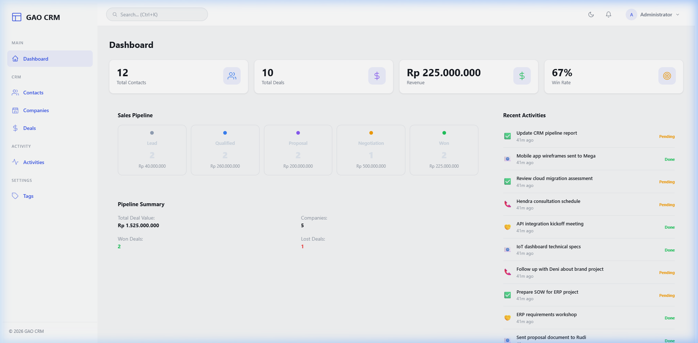
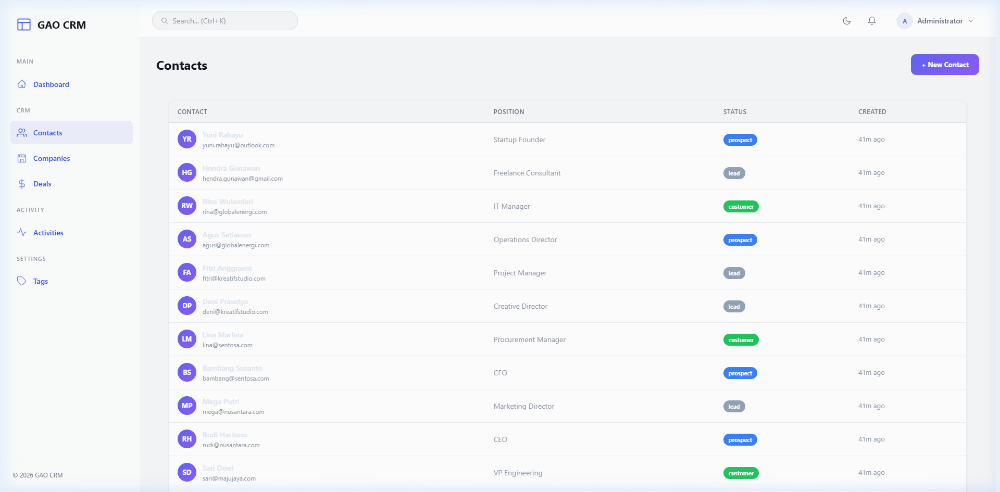
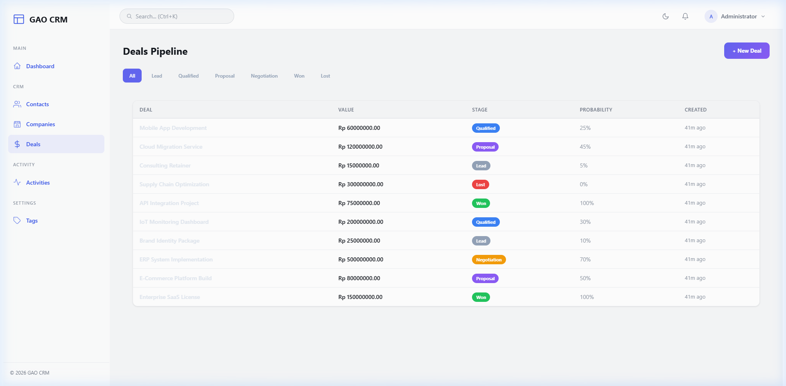

<p align="center">
  
  
  
  
</p>

# GAO CRM

A full-featured **Customer Relationship Management** application built with the [GAO Framework](https://github.com/nicepkg/gao). Manage contacts, companies, deals, activities, and track your sales pipeline — all from a clean, modern admin dashboard.

---

## ✨ Features

### Core Modules
- **📊 Dashboard** — Real-time stats, sales pipeline visualization, revenue metrics, win rate, and recent activity feed
- **👥 Contacts** — Full CRUD with search, status filtering (Lead → Prospect → Customer → Churned), and company association
- **🏢 Companies** — Company profiles with related contacts, deals, employee count, and revenue tracking
- **💰 Deals Pipeline** — Visual pipeline management (Lead → Qualified → Proposal → Negotiation → Won/Lost) with stage filters
- **📋 Activities** — Log calls, meetings, emails, and tasks linked to contacts and deals
- **📝 Notes** — Polymorphic note system for contacts and deals with inline creation
- **🏷️ Tags** — Flexible tagging system for contacts and deals

### Technical Highlights
- **🔐 Authentication** — JWT-based auth with Argon2 password hashing
- **🛡️ RBAC** — Role-based access control (Admin, Sales Manager, Sales Rep)
- **🗄️ Active Record ORM** — Type-safe database access with soft delete support
- **🎨 Server-Side Rendered** — Fast, glassmorphism-inspired admin UI via `@gao/ui`
- **📄 RESTful API** — Full JSON API for all entities alongside HTML pages

---

## 📸 Screenshots

### Dashboard
> Stats cards, sales pipeline stages, win/loss summary, and recent activity feed.



### Contacts
> Searchable contact list with avatar initials, status badges, and quick actions.



### Deals Pipeline
> Pipeline view with stage filters, deal values, and probability tracking.



---

## 🚀 Quick Start

### Prerequisites

| Requirement | Version |
|-------------|---------|
| Node.js     | 22+     |
| pnpm        | 9+      |
| PostgreSQL  | 15+     |

### 1. Clone & Install

```bash
git clone <repository-url>
cd gao-framework

# Install all workspace dependencies
pnpm install
```

### 2. Create Database

```sql
CREATE DATABASE *******;
```

### 3. Configure Environment

Database configuration is in `gao-crm/gao.config.ts`. Update the credentials if needed:

```typescript
database: {
    driver: 'postgres',
    host: 'localhost',
    port: 5432,
    database: '*******',
    user: '*******',
    password: '*******',
}
```

You can override the password via environment variable:

```bash
export DB_PASSWORD=your_password
```

### 4. Run Migrations

```bash
cd gao-crm
pnpm migrate
```

### 5. Seed Sample Data

```bash
pnpm seed
```

This creates:
- **3 users** (admin, sales manager, sales rep)
- **5 companies** across various industries
- **12 contacts** with different statuses
- **10 deals** across all pipeline stages
- **12 activities** (calls, meetings, emails, tasks)
- **5 tags** (Hot Lead, VIP, Follow Up, Pending, Archived)

### 6. Start Development Server

```bash
pnpm dev
```

Open [http://localhost:3000](http://localhost:3000) in your browser.

### 7. Login

| Field    | Value              |
|----------|--------------------|
| Email    | `admin@gaocrm.com` |
| Password | `password123`      |

---

## 📁 Project Structure

```
gao-crm/
├── gao.config.ts                    # App + database configuration
├── package.json                     # Dependencies & scripts
├── tsconfig.json                    # TypeScript configuration
└── src/
    ├── app.ts                       # Main entry point & server bootstrap
    │
    ├── controllers/                 # Route handlers
    │   ├── auth.controller.ts       # Login/logout pages
    │   ├── dashboard.controller.ts  # Dashboard page
    │   ├── contact.controller.ts    # Contact list, detail, edit pages
    │   ├── company.controller.ts    # Company list, detail, edit pages
    │   ├── deal.controller.ts       # Deal pipeline, detail, edit pages
    │   ├── activity.controller.ts   # Activity list page
    │   └── api/                     # JSON API endpoints
    │       ├── auth.api.controller.ts
    │       ├── contact.api.controller.ts
    │       ├── company.api.controller.ts
    │       ├── deal.api.controller.ts
    │       ├── activity.api.controller.ts
    │       ├── note.api.controller.ts
    │       ├── tag.api.controller.ts
    │       └── dashboard.api.controller.ts
    │
    ├── models/                      # Active Record models
    │   ├── user.model.ts
    │   ├── contact.model.ts
    │   ├── company.model.ts
    │   ├── deal.model.ts
    │   ├── deal-stage.model.ts
    │   ├── activity.model.ts
    │   ├── note.model.ts
    │   └── tag.model.ts
    │
    ├── services/                    # Business logic layer
    │   ├── auth.service.ts          # Authentication (JWT + Argon2)
    │   ├── contact.service.ts
    │   ├── company.service.ts
    │   ├── deal.service.ts
    │   ├── activity.service.ts
    │   ├── note.service.ts
    │   ├── tag.service.ts
    │   └── dashboard.service.ts     # Dashboard aggregation queries
    │
    ├── middleware/
    │   └── auth.middleware.ts       # JWT verification middleware
    │
    ├── migrations/                  # Database migration files (001-010)
    ├── helpers/                     # Utility functions
    │   ├── escape.ts                # HTML escaping (XSS prevention)
    │   ├── format.ts                # Currency & date formatting
    │   └── pagination.ts            # Pagination helper
    │
    ├── views/
    │   └── renderer.ts              # Admin template layout renderer
    │
    ├── migrate.ts                   # Migration runner script
    └── seed.ts                      # Database seeder
```

---

## 🗄️ Database Schema

### Entity Relationship

```
users (1) ──────── (N) contacts
users (1) ──────── (N) deals
users (1) ──────── (N) activities
companies (1) ──── (N) contacts
companies (1) ──── (N) deals
contacts (1) ───── (N) deals
contacts (1) ───── (N) activities
deals (1) ──────── (N) activities
deal_stages (1) ── (N) deals
contacts (M) ───── (N) tags  [via contacts_tags]
deals (M) ──────── (N) tags  [via deals_tags]
contacts (1) ───── (N) notes
deals (1) ──────── (N) notes
```

### Tables

| Table | Description |
|-------|-------------|
| `users` | Application users with roles (admin, sales_manager, sales_rep) |
| `companies` | Companies with industry, revenue, and employee data |
| `contacts` | Contacts linked to companies and assigned to users |
| `deal_stages` | Pipeline stages (Lead, Qualified, Proposal, Negotiation, Won, Lost) |
| `deals` | Business deals with value, probability, and stage tracking |
| `activities` | Logged interactions (call, meeting, email, task) |
| `notes` | Polymorphic notes on contacts and deals |
| `tags` | Color-coded labels for categorization |
| `contacts_tags` | Junction table for contact-tag M:N relationship |
| `deals_tags` | Junction table for deal-tag M:N relationship |

All tables use **UUID primary keys**, **timestamp audit columns** (`created_at`, `updated_at`), and **soft delete** (`deleted_at`).

---

## 🔌 API Reference

### Authentication

| Method | Endpoint | Auth | Description |
|--------|----------|------|-------------|
| `POST` | `/api/auth/login` | No | Login, returns JWT |
| `POST` | `/api/auth/logout` | Bearer | Logout |
| `GET` | `/api/auth/me` | Bearer | Current user info |

### Contacts

| Method | Endpoint | Auth | Description |
|--------|----------|------|-------------|
| `GET` | `/api/contacts` | Bearer | List (paginated, searchable) |
| `POST` | `/api/contacts` | Bearer | Create contact |
| `GET` | `/api/contacts/:id` | Bearer | Get contact |
| `PUT` | `/api/contacts/:id` | Bearer | Update contact |
| `DELETE` | `/api/contacts/:id` | Bearer | Soft delete |

### Companies

| Method | Endpoint | Auth | Description |
|--------|----------|------|-------------|
| `GET` | `/api/companies` | Bearer | List (paginated) |
| `POST` | `/api/companies` | Bearer | Create company |
| `GET` | `/api/companies/:id` | Bearer | Get company |
| `PUT` | `/api/companies/:id` | Bearer | Update company |
| `DELETE` | `/api/companies/:id` | Bearer | Soft delete |

### Deals

| Method | Endpoint | Auth | Description |
|--------|----------|------|-------------|
| `GET` | `/api/deals` | Bearer | List (filterable by stage) |
| `POST` | `/api/deals` | Bearer | Create deal |
| `GET` | `/api/deals/:id` | Bearer | Get deal |
| `PUT` | `/api/deals/:id` | Bearer | Update deal |
| `PATCH` | `/api/deals/:id/stage` | Bearer | Move deal to different stage |
| `DELETE` | `/api/deals/:id` | Bearer | Soft delete |

### Activities

| Method | Endpoint | Auth | Description |
|--------|----------|------|-------------|
| `GET` | `/api/activities` | Bearer | List activities |
| `POST` | `/api/activities` | Bearer | Create activity |
| `GET` | `/api/activities/:id` | Bearer | Get activity |
| `PUT` | `/api/activities/:id` | Bearer | Update activity |
| `PATCH` | `/api/activities/:id/complete` | Bearer | Mark as completed |
| `DELETE` | `/api/activities/:id` | Bearer | Soft delete |

### Notes

| Method | Endpoint | Auth | Description |
|--------|----------|------|-------------|
| `GET` | `/api/notes?notable_type=contact&notable_id=:id` | Bearer | List notes |
| `POST` | `/api/notes` | Bearer | Create note |
| `PUT` | `/api/notes/:id` | Bearer | Update note |
| `DELETE` | `/api/notes/:id` | Bearer | Soft delete |

### Tags

| Method | Endpoint | Auth | Description |
|--------|----------|------|-------------|
| `GET` | `/api/tags` | Bearer | List tags |
| `POST` | `/api/tags` | Bearer | Create tag (admin only) |
| `PUT` | `/api/tags/:id` | Bearer | Update tag (admin only) |
| `DELETE` | `/api/tags/:id` | Bearer | Delete tag (admin only) |

### Dashboard

| Method | Endpoint | Auth | Description |
|--------|----------|------|-------------|
| `GET` | `/api/dashboard/stats` | Bearer | Dashboard statistics |

### Response Format

All API responses follow a consistent envelope format:

```json
// Success
{
    "data": { ... },
    "meta": { "page": 1, "per_page": 15, "total": 42, "total_pages": 3 }
}

// Error
{
    "error": { "message": "Validation failed", "code": 422 }
}
```

---

## 🔐 Security

| Area | Implementation |
|------|----------------|
| Password Hashing | **Argon2** via `@gao/security` |
| Authentication | **JWT** with configurable expiry |
| Authorization | **RBAC** (Admin, Sales Manager, Sales Rep) |
| Input Validation | Server-side on all API endpoints |
| SQL Injection | Parameterized queries via `@gao/orm` Query Builder |
| XSS Prevention | HTML escaping on all rendered output |
| Rate Limiting | Configurable via `gao.config.ts` |
| Soft Delete | All data uses `deleted_at` — no hard deletes |

---

## 🛠️ Available Scripts

| Script | Command | Description |
|--------|---------|-------------|
| **Dev** | `pnpm dev` | Start dev server with hot reload (`tsx watch`) |
| **Start** | `pnpm start` | Start production server |
| **Build** | `pnpm build` | Compile TypeScript to JavaScript |
| **Migrate** | `pnpm migrate` | Run database migrations |
| **Migrate Fresh** | `pnpm migrate:fresh` | Drop all & re-run migrations |
| **Seed** | `pnpm seed` | Populate database with sample data |

---

## 🧰 Tech Stack

### Framework & Runtime
- [GAO Framework](https://github.com/nicepkg/gao) — TypeScript-first full-stack framework
- [Node.js 22+](https://nodejs.org/) — Runtime environment
- [TypeScript 5.9+](https://www.typescriptlang.org/) — Type-safe development

### Core Packages (GAO Workspace)
| Package | Purpose |
|---------|---------|
| `@gao/core` | Configuration & lifecycle management |
| `@gao/http` | HTTP server, routing, decorators (`@Controller`, `@Get`, `@Post`) |
| `@gao/orm` | Active Record ORM with Query Builder & migrations |
| `@gao/view` | Template engine |
| `@gao/ui` | Admin dashboard template (sidebar, navbar, cards, tables) |
| `@gao/security` | JWT, Argon2 hashing, RBAC, rate limiting, XSS guard |

### Database
- [PostgreSQL 15+](https://www.postgresql.org/) — Primary database
- [`pg` (node-postgres)](https://node-postgres.com/) — PostgreSQL driver

### Dev Tools
- [`tsx`](https://github.com/privatenumber/tsx) — Fast TypeScript execution
- [`pino-pretty`](https://github.com/pinojs/pino-pretty) — Pretty-printed development logs

---

## 👥 Default Users

| Name | Email | Password | Role |
|------|-------|----------|------|
| Administrator | `admin@gaocrm.com` | `password123` | `admin` |
| Sarah Manager | `sarah@gaocrm.com` | `password123` | `sales_manager` |
| Rudi Sales | `rudi@gaocrm.com` | `password123` | `sales_rep` |

---

## 🔧 Configuration

Application configuration is managed through `gao.config.ts`:

```typescript
import { defineConfig } from '@gao/core';

export default defineConfig({
    app: {
        name: 'GAO CRM',
        port: 3000,
        environment: 'development',
        debug: true,
    },
    database: {
        driver: 'postgres',
        host: 'localhost',
        port: 5432,
        database: 'gaocrm',
        user: 'postgres',
        password: process.env.DB_PASSWORD ?? 'root',
    },
    security: {
        cors: { origin: '*' },
        rateLimit: { windowMs: 60_000, maxRequests: 100 },
    },
});
```

### Environment Variables

| Variable | Default | Description |
|----------|---------|-------------|
| `DB_PASSWORD` | `root` | PostgreSQL password |
| `JWT_SECRET` | Auto-generated | Secret for JWT signing |

---

## 📝 License

This project is private and not licensed for distribution.

---

<p align="center">
  Built with ❤️ using <strong>GAO Framework</strong>
</p>
